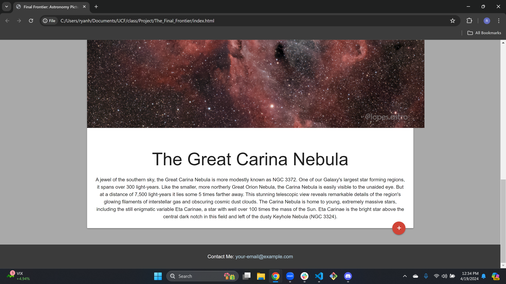
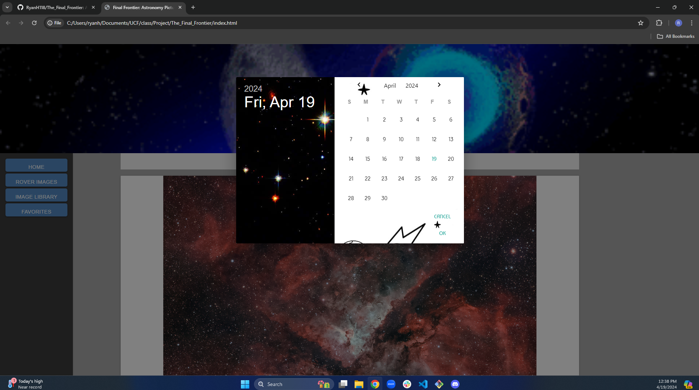
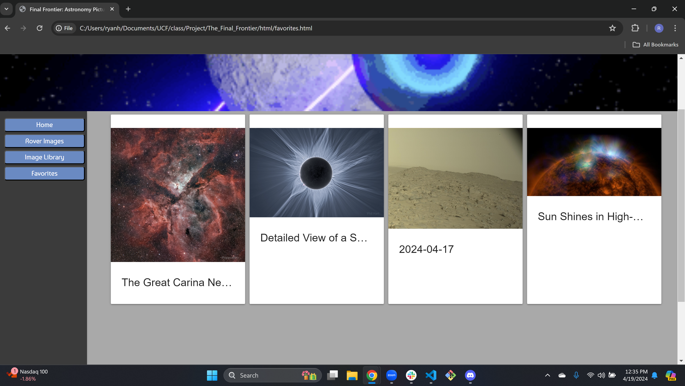

# The_Final_Frontier

## Description

Our motivation for this project was to give people easy access to space images and see the beauty of outer space. We built this project to test how we work together as a team and overcome challenges together. We also wanted to work with third-party APIs and a new CSS framework instead of bootstrap. We solved the problem of not being able to have easy access to NASA images and the descriptions that come with those pictures. We learned how to use Materialize framework where we are semi-pros at it. We also learned how to fetch APIs and take parameters that we need to get the data we need. We learned a great degree of how modals work and how to use a function with a modal calendar to make pictures appear when a date is clicked.

## Website Link

https://ryanh118.github.io/The_Final_Frontier/

## Usage

## Credits

Ryan Hinson: https://github.com/RyanH118

Ian Turnberg: https://github.com/iturnberg

Hunter Leclair: https://github.com/TurnerHelical

Carlos Lavayen Borja: https://github.com/CarlosLavayenJr

